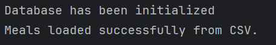
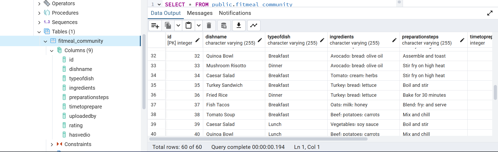
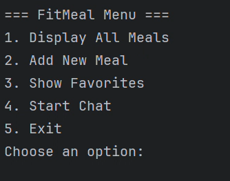
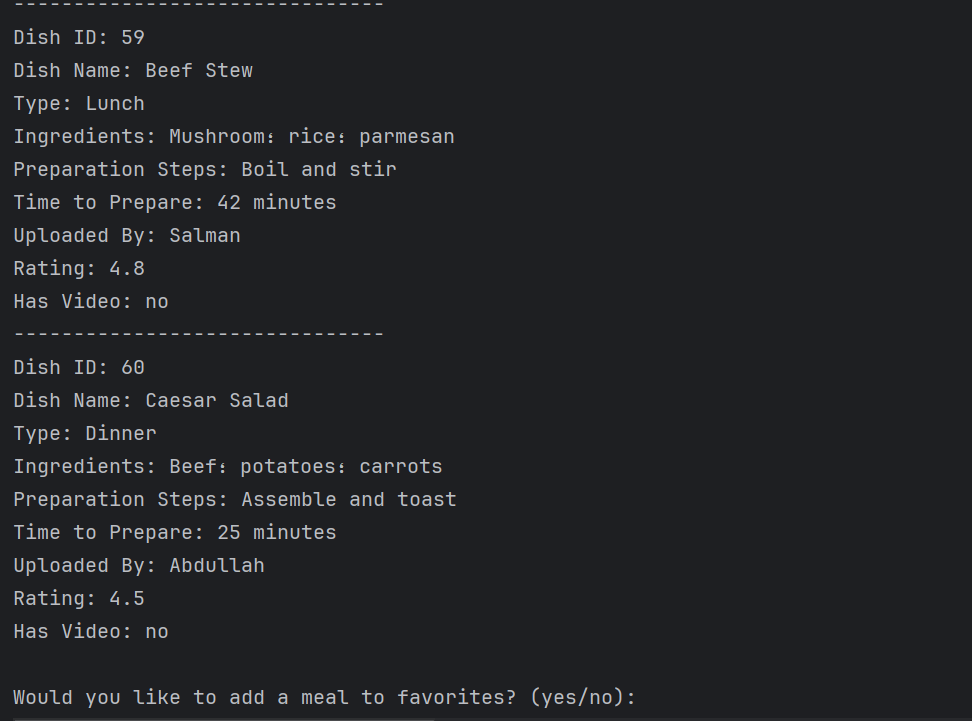
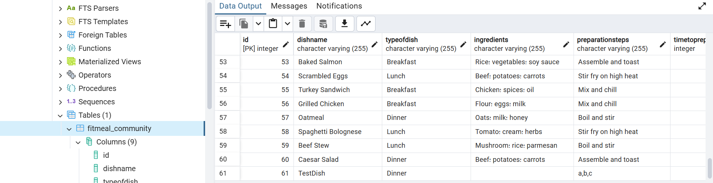
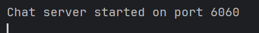
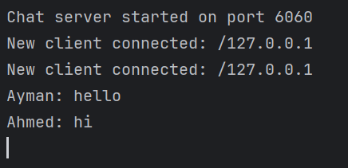

# FitMeal-Community-CPIT305-Group-Project
This app aims to simplify preparing your favorite meals and discovering new dishes with easy-to-follow instructions. Moreover, it includes reviews from people who have tried these meals—Was it delicious? Did it take too long to prepare? And so much more...

## Features
- Easy Search for Specific Meals
- An Interactive Community
- Saving Time
- Offline Access To Recepies

## Contributors
This project was created by CPIT-305 Group:
- Abdulaziz Shaheen
- Ahmed Alluqmani
- Ayman Turkistani

## Concepts Applied
- Java Exceptions
- I/O Operations
- Multi-Threading
- Netwroking
- JDBC

## Prerequisites

- *Java 11 or higher*: Ensure you have Java installed on your system.
- *Maven*: Used for dependency management and building the project.
- *Docker & Docker Compose*: Required to set up the PostgreSQL database and pgAdmin.

## Setup

1. Clone the Repository
2. Start the PostgreSQL database and pgAdmin using Docker Compose:

```bash
docker-compose up
```
3. Run the main app App.java.
  - This will start the database server and pgAdmin.
  - It will also create the database and table. 
  - It will also populate the table with data from the CSV file.

      
    ___
          

4. After running the app, it should prompt you to select an option: 

      

5. ⁠When choose 1, display all dishes in DB:

      

6. ⁠When choose 2, you will be able to add dish in DB. Here is the table after insert new dish:

      

7. ⁠When choose 3, list of favorite meal will displayed.

8. Before choose 4, be sure the server is active:

      

9. Choose 4, and then many clients will be able to join and chat with each other. Note: The chat feature includes a filter that replaces inappropriate words with ****.

      

## AI Usage Disclosure
Gen AI, specifically ChatGPT, was used to assist in establishing unit testing.
